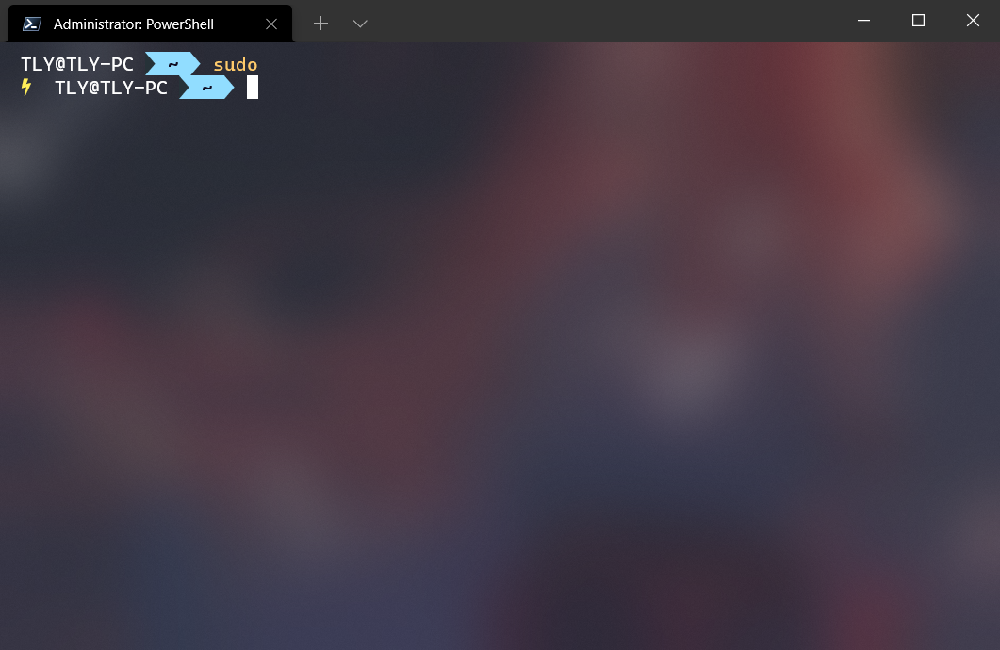
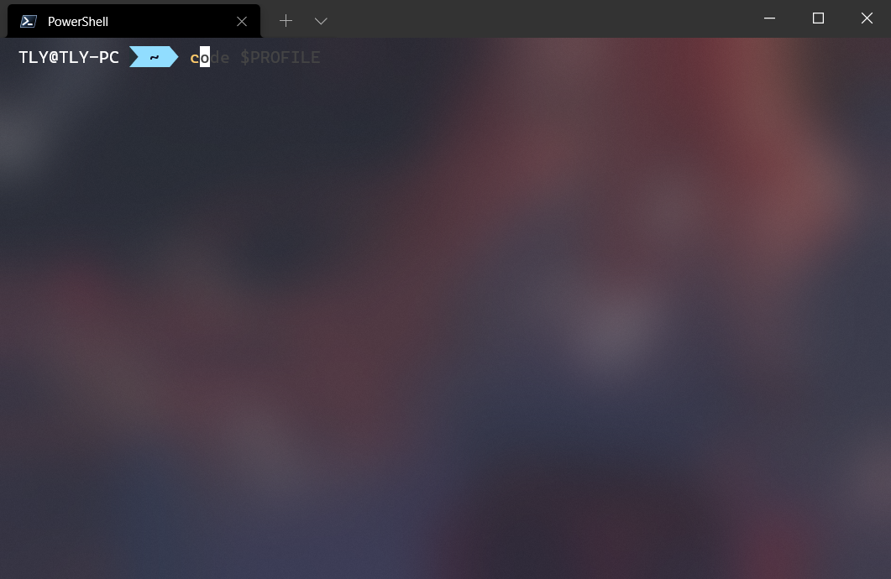
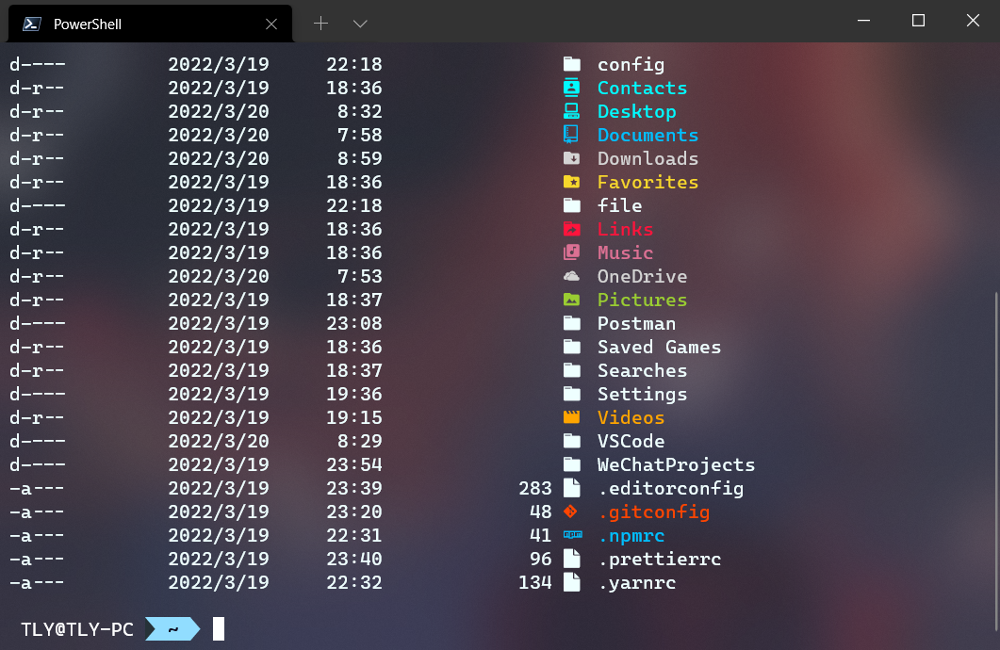

## PowerShell 简介

需要使用**最新**的 PowerShell，配合 Windows Terminal 体验更佳。

::: tip
Windows Terminal 可以从 Microsoft Store（微软商店）下载。
:::

[PowerShell 文档 - PowerShell | Microsoft Docs](https://docs.microsoft.com/zh-cn/powershell/)

[PowerShell/PowerShell: PowerShell for every system! (github.com)](https://github.com/PowerShell/PowerShell)

[microsoft/terminal: The new Windows Terminal and the original Windows console host, all in the same place! (github.com)](https://github.com/microsoft/terminal)

## 1. gsudo

gsudo 可以让你在 powershell 或其他 Windows 终端上使用 sudo 命令来提升权限。

::: warning
**注意**：这个不仅可用于 PowerShell
:::



相关链接：[gerardog/gsudo: A Sudo for Windows - run elevated without spawning a new Console Host Window (github.com)](https://github.com/gerardog/gsudo)

## 2. PSReadLine

这是我的 PSReadLine 配置：

```powershell
Set-PSReadLineOption -PredictionSource History
Set-PSReadlineKeyHandler -Key Tab -Function MenuComplete
Set-PSReadLineKeyHandler -Chord "Ctrl+f" -Function ForwardWord
```

这能够使你的 powershell 提供历史记录的提示、类似 zsh 的菜单提示以及可以使用 Ctrl + f 来提示一个单词。



相关链接：[关于 PSReadLine - PowerShell | Microsoft Docs](https://docs.microsoft.com/zh-cn/powershell/module/psreadline/about/about_psreadline?view=powershell-7.2)

## 3. posh-git

这是一个 git 的 powershell 库，能够提供一些 git 的提示。

`安装`：

```powershell
Install-Module posh-git -Scope CurrentUser
```

`配置`：

```powershell
Import-Module posh-git
```

相关链接：[dahlbyk/posh-git: A PowerShell environment for Git (github.com)](https://github.com/dahlbyk/posh-git/)

## 4. git-aliases

如果说只有 git 提示还不够，那还可以使用这个库。

这是一个类似于 ohmyzsh 的 git 插件。

`安装`：

```powershell
Install-Module git-aliases -Scope CurrentUser -AllowClobber
```

`配置`：

```powershell
Import-Module git-aliases -DisableNameChecking
```

我列举几个常用的命令：

| Alias | Command        |
| ----- | -------------- |
| g     | git            |
| ga    | git add        |
| gaa   | git add --all  |
| gb    | git branch     |
| gcmsg | git commit -m  |
| gl    | git pull       |
| gp    | git push       |
| gra   | git remote add |

相关链接：[ohmyzsh/plugins/git at master · ohmyzsh/ohmyzsh (github.com)](https://github.com/ohmyzsh/ohmyzsh/tree/master/plugins/git)

## 5. oh-my-posh

美化 powershell 的库。

::: warning
**注意**：需要使用 [nerd-fonts](https://github.com/ryanoasis/nerd-fonts) 字体，这里我推荐使用 [CascadiaCode](https://github.com/ryanoasis/nerd-fonts/releases/download/v2.1.0/CascadiaCode.zip) 的 CaskaydiaCove Nerd Font
:::

推荐使用我的版本和配置，效果图你已经看到过了！（从上往下看的话。🐶）

`安装`：

```powershell
Install-Module oh-my-posh -RequiredVersion 3.112.1 -Scope CurrentUser
```

`配置`：

```powershell
Import-Module oh-my-posh
Set-PoshPrompt -Theme powerline
```

相关链接：[Home | Oh My Posh](https://ohmyposh.dev/)

## 6. Terminal-Icons

一些文件图标。

::: warning
**注意**：需要使用 [nerd-fonts](https://github.com/ryanoasis/nerd-fonts) 字体，这里我推荐使用 [CascadiaCode](https://github.com/ryanoasis/nerd-fonts/releases/download/v2.1.0/CascadiaCode.zip) 的 CaskaydiaCove Nerd Font
:::



`安装`：

```powershell
Install-Module -Name Terminal-Icons -Repository PSGallery
```

`配置`：

```powershell
Import-Module -Name Terminal-Icons
```

相关链接：[devblackops/Terminal-Icons: A PowerShell module to show file and folder icons in the terminal (github.com)](https://github.com/devblackops/Terminal-Icons)

## 一次性打包带走

gsudo：[Releases · gerardog/gsudo (github.com)](https://github.com/gerardog/gsudo/releases)

`安装`：

```powershell
Install-Module posh-git -Scope CurrentUser
Install-Module git-aliases -Scope CurrentUser -AllowClobber
Install-Module oh-my-posh -Scope CurrentUser
Install-Module -Name Terminal-Icons -Repository PSGallery
```

`配置`：

```powershell
code $PROFILE
```

```powershell
Set-PSReadLineOption -PredictionSource History
Set-PSReadlineKeyHandler -Key Tab -Function MenuComplete
Set-PSReadLineKeyHandler -Chord "Ctrl+f" -Function ForwardWord
Import-Module posh-git
Import-Module git-aliases -DisableNameChecking
Import-Module oh-my-posh
Set-PoshPrompt -Theme robbyrussel
Import-Module -Name Terminal-Icons
```
