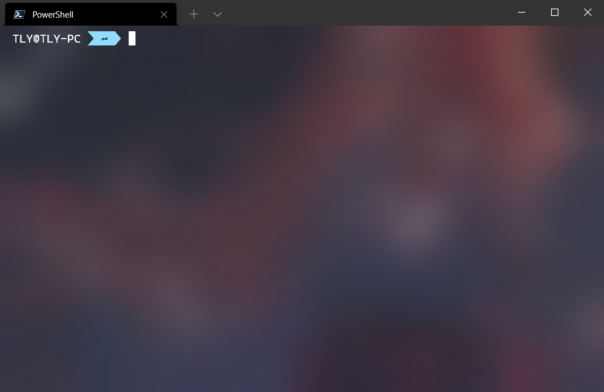

## Windows Terminal 简介

Windows 上非常棒的终端。

Windows 11 已经内置了。



相关链接：[microsoft/terminal: The new Windows Terminal and the original Windows console host, all in the same place! (github.com)](https://github.com/microsoft/terminal)

## 我的部分配置

### profiles.list

```json
[
  {
    "commandline": "%SystemRoot%\\System32\\cmd.exe",
    "guid": "{0caa0dad-35be-5f56-a8ff-afceeeaa6101}",
    "hidden": true,
    "name": "\u547d\u4ee4\u63d0\u793a\u7b26"
  },
  {
    "commandline": "%SystemRoot%\\System32\\WindowsPowerShell\\v1.0\\powershell.exe",
    "guid": "{61c54bbd-c2c6-5271-96e7-009a87ff44bf}",
    "hidden": true,
    "name": "Windows PowerShell"
  },
  {
    "guid": "{b453ae62-4e3d-5e58-b989-0a998ec441b8}",
    "hidden": true,
    "name": "Azure Cloud Shell",
    "source": "Windows.Terminal.Azure"
  },
  {
    "commandline": "pwsh.exe -nol",
    "guid": "{574e775e-4f2a-5b96-ac1e-a2962a402336}",
    "hidden": false,
    "name": "PowerShell",
    "source": "Windows.Terminal.PowershellCore"
  }
]
```

### schemes

```json
{
  "background": "#263238",
  "black": "#000000",
  "blue": "#82AAFF",
  "brightBlack": "#546E7A",
  "brightBlue": "#82AAFF",
  "brightCyan": "#89DDFF",
  "brightGreen": "#C3E88D",
  "brightPurple": "#C792EA",
  "brightRed": "#FF5370",
  "brightWhite": "#FFFFFF",
  "brightYellow": "#FFCB6B",
  "cursorColor": "#FFFFFF",
  "cyan": "#89DDFF",
  "foreground": "#EEFFFF",
  "green": "#C3E88D",
  "name": "Material",
  "purple": "#C792EA",
  "red": "#FF5370",
  "selectionBackground": "#FFFFFF",
  "white": "#FFFFFF",
  "yellow": "#FFCB6B"
}
```

### profiles.defaults

```json
{
  "bellStyle": "none",
  "colorScheme": "Material",
  "cursorShape": "filledBox",
  "font": {
    "face": "CaskaydiaCove Nerd Font"
  },
  "useAcrylic": true
}
```

### 其他配置

```json
{
  "initialCols": 85,
  "initialPosition": "430,205",
  "initialRows": 25
}
```
