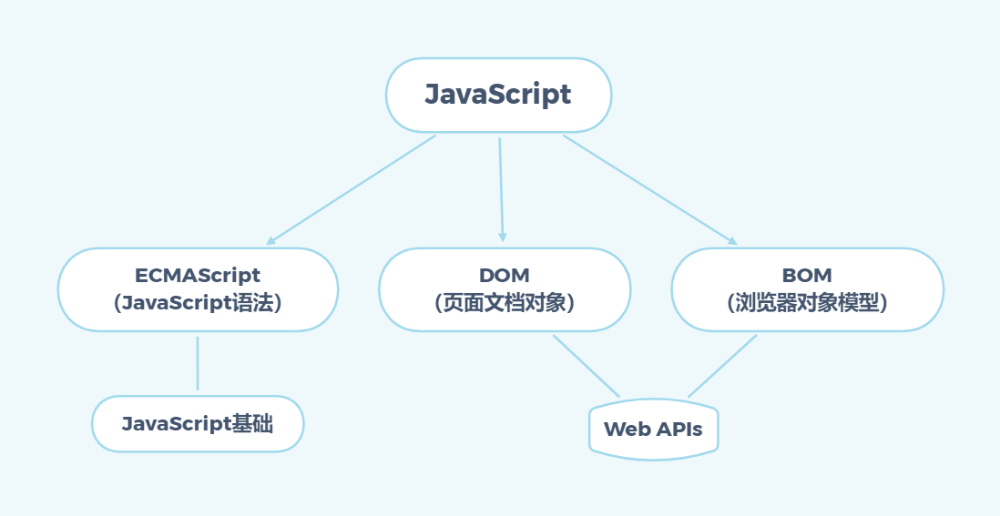
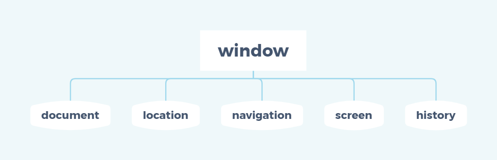

## 1. Web APIs 简介

### 目标

- 能够说出 Web APIs 阶段与 JavaScript 语法阶段的关联性
- 能够说出什么是 API
- 能够说出什么是 Web API

### 1. Web APIs 和 JS 基础关联性

#### 1. JS 的组成



#### 2. JS 基础阶段以及 Web APIs 阶段

#### **JS 基础阶段**

- 我们学习的是 ECMAScript 标准规定的基本语法
- 要求同学们掌握 JS 基础语法
- 只学习基本语法，做不了网页交互效果
- 目的是为了 JS 后面的课程打基础、做铺垫

#### **Web APIs 阶段**

- Web APIs 是 W3C 组织的标准
- Web APIs 我们主要学习 DOM 和 BOM
- Web APIs 是我们 JS 所独有的部分
- 我们主要学习页面交互功能
- 需要使用 JS 基础的课程内容做基础

JS 基础学习 ECMAScript 基础语法为后面作铺垫，Web APIs 是 JS 的应用，大量使用 JS 基础语法做交互效果

### 2. API 和 Web API

#### 1. API

**API（Application Programming Interface，应用程序编程接口）** 是一些预先定义的函数，目的是提供应用程序与开发人员基于某软件或硬件得以访问一组例程的能力，而又无需访问源码，或理解内部工作机制的细节。

简单理解：**API 是程序员提供的一种工具，以便能更轻松的实现想要完成的功能。**

比如手机充电接口：

我们要实现充电这个功能：

- 我们不关心手机内部变压器，内部怎么存储电等
- 我们不关心这个充电线怎么制作的
- 我们只指定，我们拿着充电线插进充电接口就可以充电
- 这个**充电接口就是一个 API**

#### 2. Web API

**Web API 是浏览器**提供的一套操作**浏览器功能**和**页面元素**的 **API** ( BOM 和 DOM )。

现阶段我们主要针对于浏览器讲解常用的 API , 主要针对浏览器做交互效果。

比如我们想要浏览器弹出一个警示框， 直接使用 alert('弹出')

MDN 详细 API：[https://developer.mozilla.org/zh-CN/docs/Web/API](https://developer.mozilla.org/zh-CN/docs/Web/API)

因为 Web API 很多，所以我们将这个阶段称为 **Web APIs**

#### 3. API 和 Web API 总结

1. **API 是为我们程序员提供的一个接口，帮助我们实现某种功能，我们会使用就可以了，不必纠结内部如何实现**
2. Web API 主要是针对于浏览器提供的接口，主要针对于浏览器做交互效果。
3. Web API 一般都有输入和输出（函数的传参和返回值），Web API 很多都是方法（函数）
4. 学习 Web API 可以结合前面学习内置对象方法的思路学习

## 2. DOM

### 目标

- 能够说出什么是 DOM
- 能够获取页面元素
- 能够给元素注册事件
- 能够操作 DOM 元素的书写
- 能够创建元素
- 能够操作 DOM 节点

### 1. DOM 简介

#### 1. 什么是 DOM

文档对象模型（Document Object Model，简称 **DOM**），是 W3C 组织推荐的处理可扩展标记语言（HTML 或者 XML）的标准**编程接口**。

W3C 已经定义了一系列的 DOM 接口，通过这些 DOM 接口可以改变网页的内容、结构和样式。

#### 2. DOM 树

- 文档：一个页面就是一个文档，DOM 中使用 document 表示
- 元素：页面中的所有标签都是元素，DOM 中使用 element 表示
- 节点：网页中的所有内容都是节点（标签、属性、文本、注释等），DOM 中使用 node 表示

**DOM 把以上内容都看做是对象**

### 2 获取元素

#### 1. 如何获取页面元素

DOM 在我们实际开发中主要用来操作元素。

我们如何来获取页面中的元素呢？

获取页面中的元素可以使用以下几种方式：

- 根据 ID 获取
- 根据标签名获取
- 通过 HTML5 新增的方法获取
- 特殊元素获取

#### 2. 根据 ID 获取

使用 getElementById() 方法可以获取带有 ID 的元素对象。

```javascript
document.getElementById('id')
```

使用 console.dir() 可以打印我们获取的元素对象，更好地查看对象里面的属性和方法。

#### 3. 根据标签名获取

使用 document.getElementsByTagName() 方法可以返回带有指定标签名的**对象的集合**。

```javascript
document.getElementsByTagName('标签名')
```

::: warning 注意

1. **因为得到的是一个对象的集合，所有我们想要操作里面的元素就需要遍历。**
2. **得到的元素对象是动态的**
3. **如果获取不到元素，则返回为空的伪数组（因为获取不到对象）**

:::

还可以获取某个元素（父元素）内部所以指定标签名的子元素。

```javascript
element.getElementsByTagName('标签名')
```

::: warning 注意

父元素必须是**单个对象（必须指明是哪一个元素对象）**。获取的时候不包括父元素自己。

:::

通过 HTML5 新增的方法获取

```javascript
document.getElementsByClassName('类名') // 根据类名返回元素对象集合
```

```javascript
document.querySelector('选择器') // 根据指定选择器返回第一个元素对象
```

```javascript
document.querySelectorAll('选择器') // 根据指定选择器返回
```

::: warning 注意

querySelector 和 querySelectorAll 里面的选择器需要加**符号**，比如：document.querySelector('#nav');

:::

#### 5. 获取特殊元素（body，html）

##### 获取 body 元素

```javascript
doucumnet.body // 返回body元素对象
```

##### 获取 html 元素

```javascript
document.documentElement // 返回html元素对象
```

### 3. 事件基础

#### 1. 事件概述

JavaScript 使我们有能力创建动态页面。而事件是可以被 JavaScript 侦测到的行为。

简单理解：触发——响应机制。

网页中的每个元素都可以产生某些可以触发 JavaScript 的事件，例如，我们可以在用户点击某个按钮时产生一个事件，然后去执行某些操作。

#### 2. 事件三要素

1. 事件源（谁）
2. 事件类型（什么事件）
3. 事件处理程序（做啥）

#### 3. 执行事件的步骤

1. 注册事件源
2. 注册事件（绑定事件）
3. 添加事件处理程序（采取函数赋值形式）

#### 4. 常见的鼠标事件

| 鼠标事件    | 触发条件         |
| ----------- | ---------------- |
| onclick     | 鼠标点击左键触发 |
| onmouseover | 鼠标经过触发     |
| onmouseout  | 鼠标离开触发     |
| onfocus     | 获得鼠标焦点触发 |
| onblur      | 失去鼠标焦点触发 |
| onmousemove | 鼠标移动触发     |
| onmouseup   | 鼠标弹起触发     |
| onmousedown | 鼠标按下触发     |

#### 5. 分析事件的三要素

下拉菜单要素

关闭广告要素

### 4. 操作元素

JavaScript 的 DOM 操作可以改变网页内容、结构和样式，我们可以利用 DOM 操作元素来改变元素里面的内容、属性等。注意以下都是属性

#### 1. 改变元素内容

```javascript
element.innerText
```

从起始位置到终止位置的内容，但它去除 html 标签，同时空格和换行也会去掉

```javascript
element.innerHTML
```

起始位置到终止位置的全部内容，包括 html 标签，同时保留空格和换行

#### 2. 常用元素的属性操作

1. innerText、innerHTML 改变元素内容

2. src、href

3. id、alt、title

#### 3. 表单元素的属性操作

利用 DOM 可以操作如下表单元素的属性：

type、value、checked、selected、disabled

#### 4. 样式属性操作

我们通过 JS 修改元素的大小、颜色、位置等样式。

1. element.style：行内样式
2. element.className：类名样式操作

::: warning 注意

1. **JS 里面的样式采取驼峰命名名法、比如 fontSize、backgroundColor**
2. **JS 里面修改 style 样式操作，产生的是行内样式，css 权重比较高**
3. **如果样式修改较多，可以采取操作类名方式更改元素样式。**
4. **class 因为是一个保留字，因此使用 className 来操作元素类名属性**
5. **className 会直接修改元素的类名，会覆盖原先的类名。**

:::

#### 5. 操作元素总结

操作元素是 DOM 核心内容

- 操作元素内容
  - innerText
  - **innerHTML**
- 操作常见元素属性
  - src、href、title、alt 等
- 操作表单元素属性
  - type、value、disabled 等
- 操作元素样式属性
  - element.style
  - **className**

#### 6. 排他思想

如果同一组元素，我们想要某一个元素实现某种样式，需要用到循环的排他思想算法：

1. 所有元素全部清除样式（干掉其他人）
2. 给当前元素设置样式（留下我自己）
3. 注意顺序不能颠倒，首先干掉其他人，再设置自己

#### 7. 自定义属性的操作

##### 1. 获取属性值

- **element.属性**：获取属性值
- element.getAttribute('属性');

###### 区别

- **element.属性**：获取内置属性值（元素本身自身的属性）
- element.getAttribute('属性');：主要获得自定义的属性（标准）我们程序员自定义的属性

##### 2. 设置属性值

- **element.属性 = '值'**：设置内置属性值
- element.setAttribute('属性', '值');

###### 区别

- **element.属性**：设置内置属性值
- element.setAttribute('属性');：主要设置自定义的书写（标准）

##### 3. 移除属性

- element.removeAttribute('属性');

#### 8. H5 自定义属性

**自定义属性目的：为了保存并使用数据。有些数据可以保存到页面中而不用保存到数据库中。**

自定义属性获取是通过 getAttribute('属性') 获取。

但是有些自定义属性很容易引起歧义，不容易判断元素的内容属性还是自定义属性。

H5 给我们新增了自定义属性：

##### 1. 设置 H5 自定义属性

H5 规定自定义属性 data-开头做为属性名并且赋值。

比如`<div data-index="1"></div>`

或者使用 JS 设置

`element.setAttribute('data-index', 2)`

##### 2. 获取 H5 自定义属性

1. 兼容性获取 element.getAttribute('data-index');
2. H5 新增 element.dataset.**index** 或者 element.dataset['**index**'] ie 11 才开始支持

### 5. 节点操作

#### 1. 为什么学节点操作

获取元素通常使用两种方式：

##### **1. 利用 DOM 提供的方法获取元素**

- document.getElementById()
- document.getElementsByTagName()
- document.querySelector 等
- 逻辑性不强、繁琐

##### **2. 利用节点层级关系获取元素**

- 利用父子兄节点关系获取元素

- 逻辑性强， 但是兼容性稍差

这两种方式都可以获取元素节点，我们后面都会使用，但是节点操作更简单

#### 2. 节点概述

网页中的所有内容都是节点（标签、属性、文本、注释等），在 DOM 中，节点使用 node 来表示。

HTML DOM 树中的所有节点均可通过 JavaScript 进行访问，所有 HTML 元素（节点）均可被修改，也可以创建或删除。

一般地，节点至少拥有 nodeType（节点类型）、nodeName（节点名称）和 nodeValue（节点值）这三个基本属性。

- 元素节点 nodeType 为 1

- 属性节点 nodeType 为 2

- 文本节点 nodeType 为 3 （文本节点包含文字、空格、换行等）

**我们在实际开发中，节点操作主要操作的是元素节点**

#### 3. 节点层级

利用 DOM 树可以把节点划分为不同的层级关系，常见的是**父子兄层级关系**。

##### 1. 父级节点

```javascript
node.parentNode
```

- parentNode 属性可返回某节点的父节点，注意是**最近的一个父节点**
- 如果指定的节点没有父节点则返回 null

##### 2. 子节点

```javascript
parentNode.childNodes(标准)
```

parentNode.childNodes 返回包含指定节点的子节点的集合，该集合为即时更新的集合。

::: warning 注意

**返回值里面包含了所有的子节点，包括元素节点，文本节点等。**

**如果只想要获得里面的元素节点，则需要专门处理。 所以我们一般不提倡使用 childNodes**

:::

```javascript
var ul = document.querySelector('ul')
for (var i = 0; i < ul.childNodes.length; i++) {
  if (ul.childNodes[i].nodeType == 1) {
    // ul.childNodes[i] 是元素节点
    console.log(ul.childNodes[i])
  }
}
```

```javascript
parentNode.children(非标准)
```

**parentNode.children** 是一个只读属性，返回所有的子元素节点。它只返回子元素节点，其余节点不返回 （**这个是我们重点掌握的**）。

虽然 children 是一个非标准，但是得到了各个浏览器的支持，因此我们可以放心使用

```javascript
parentNode.firstChild
```

firstChild 返回第一个子节点，找不到则返回 null。同样，也是包含所有的节点。

```javascript
parentNode.lastChild
```

lastChild 返回最后一个子节点，找不到则返回 null。同样，也是包含所有的节点。

```javascript
parentNode.firstElementChild
```

firstElementChild 返回第一个子元素节点，找不到则返回 null。

```javascript
parentNode.lastElementChild
```

lastElementChild 返回最后一个子元素节点，找不到则返回 null。

::: warning 注意

**这两个方法有兼容性问题，IE9 以上才支持。**

:::

实际开发中，firstChild 和 lastChild 包含其他节点，操作不方便，而 firstElementChild 和 lastElementChild 又有兼容性问题，那么我们如何获取第一个子元素节点或最后一个子元素节点呢？

**解决方案：**

1. **如果想要第一个子元素节点，可以使用**

   ```javascript
   parentNode.chilren[0]
   ```

2. **如果想要最后一个子元素节点，可以使用**

   ```javascript
   parentNode.chilren[parentNode.chilren.length - 1]
   ```

##### 3. 兄弟节点

```javascript
node.nextsibling
```

nextSibling 返回当前元素的下一个兄弟元素节点，找不到则返回 null。同样，也是包含所有的节点。

```javascript
node.previousSibling
```

previousSibling 返回当前元素上一个兄弟元素节点，找不到则返回 null。同样，也是包含所有的节点。

```javascript
node.nextElementSibling
```

nextElementSibling 返回当前元素下一个兄弟元素节点，找不到则返回 null。

```javascript
node.previousElementSibling
```

previousElementSibling 返回当前元素上一个兄弟节点，找不到则返回 null。

::: warning 注意

**这两个方法有兼容性问题， IE9 以上才支持。**

:::

**问：如何解决兼容性问题？**

答：自己封装一个兼容性的函数

```javascript
function getNextElementSibling(element) {
  var el = element
  while ((el = el.nextSibling)) {
    if (el.nodeType === 1) {
      return el
    }
  }
  return null
}
```

##### 4. 创建节点

```javascript
document.createElement('tagName')
```

document.createElement() 方法创建由 tagName 指定的 HTML 元素。因为这些元素原先不存在，是根据我们的需求动态生成的，所以我们也称为**动态创建元素节点**。

```javascript
node.appendChild(child)
```

node.appendChild() 方法将一个节点添加到指定父节点的子节点列表**末尾**。类似于 CSS 里面的 after 伪元素。

```javascript
node.insertBefore(child, 指定元素)
```

node.insertBefore() 方法将一个节点添加到父节点的指定子节点**前面**。类似于 CSS 里面的 before 伪元素。

##### 5. 删除节点

```javascript
node.removeChild(child)
```

node.removeChild() 方法从 DOM 中删除一个子节点，返回删除的节点。

##### 6. 复制节点（克隆节点）

```javascript
node.cloneNode()
```

node.cloneNode() 方法返回调用该方法的节点的一个副本。 也称为克隆节点/拷贝节点

::: warning 注意

1. 如果括号参数为**空或者为 false** ，则是**浅拷贝**，即只克隆复制节点本身，不克隆里面的子节点。
2. 如果括号参数为 **true** ，则是**深度拷贝**，会复制节点本身以及里面所有的子节点。

:::

##### 7. 三种动态创建元素区别

- document.write()
- element.innerHTL
- document.createElement()

###### 区别

1. document.write 是直接将内容写入页面的内容流，**但是文档流执行完毕，则它会导致页面全部重绘**

2. innerHTML 是将内容写入某个 DOM 节点，不会导致页面全部重绘

3. innerHTML 创建多个元素效率更高（不要拼接字符串，采取数组形式拼接），结构稍微复杂

4. createElement() 创建多个元素效率稍低一点点，但是结构更清晰

**总结：不同浏览器下，innerHTML 效率要比 creatElement 高**

#### 6. DOM 重点核心

文档对象模型（Document Object Model，简称 **DOM**），是 W3C 组织推荐的处理可扩展标记语言（HTML 或者 XML）的标准**编程接口**。

W3C 已经定义了一系列的 DOM 接口，通过这些 DOM 接口可以改变网页的内容、结构和样式。

1. 对于 JavaScript，为了能够使 JavaScript 操作 HTML，JavaScript 就有了一套自己的 dom 编程接口。

2. 对于 HTML，dom 使得 html 形成一棵 dom 树. 包含 文档、元素、节点

我们获取过来的 DOM 元素是一个对象（object），所以称为 文档对象模型

关于 dom 操作，我们主要针对于元素的操作。主要有创建、增、删、改、查、属性操作、事件操作。

##### 1. 创建

1. document.write

2. innerHTML

3. createElement

##### 2. 增

1. appendChild

2. insertBefore

##### 3. 删

1. removeChild

##### 4. 改

主要修改 dom 的元素属性，dom 元素的内容、属性, 表单的值等

1. 修改元素属性： src、href、title 等

2. 修改普通元素内容： innerHTML 、innerText

3. 修改表单元素： value、type、disabled 等

4. 修改元素样式： style、className

##### 5. 查

主要获取查询 dom 的元素

1. DOM 提供的 API 方法： getElementById、getElementsByTagName 古老用法 不太推荐

2. H5 提供的新方法： querySelector、querySelectorAll 提倡

3. 利用节点操作获取元素： 父(parentNode)、子(children)、兄(previousElementSibling、nextElementSibling) 提倡

##### 6. 属性操作

主要针对于自定义属性。

1. setAttribute：设置 dom 的属性值

2. getAttribute：得到 dom 的属性值

3. removeAttribute 移除属性

##### 7. 事件操作

给元素注册事件， 采取 事件源.事件类型 = 事件处理程序

| 鼠标事件    | 触发条件         |
| ----------- | ---------------- |
| onclick     | 鼠标点击左键触发 |
| onmouseover | 鼠标经过触发     |
| onmouseout  | 鼠标离开触发     |
| onfocus     | 获得鼠标焦点触发 |
| onblur      | 失去鼠标焦点触发 |
| onmousemove | 鼠标移动触发     |
| onmouseup   | 鼠标弹起触发     |
| onmousedown | 鼠标按下触发     |

## 3. 事件高级

### 目标

- 能够写出元素注册事件的两种方式
- 能够说出删除事件的两种方式
- 能够说出 DOM 事件流的三个阶段
- 能够利用事件对象完成跟随鼠标案例
- 能够封装组织冒泡的兼容性函数
- 能够说出事件委托的原理
- 能够说出常用的鼠标和键盘事件

### 1. 注册事件（绑定事件）

#### 1. 注册事件概述

给元素添加事件，称为**注册事件**或者**绑定事件**。

注册事件有两种方式：**传统方式和方法监听注册方式**

##### 传统注册方式

- 利用 on 开头的事件 onclick
- `<button onclick="alert('h1~')"></button>`
- `btn.onclick = function(){}`
- 特点：注册事件的**唯一性**
- 同一个元素同一个事件只能设置一个处理函数，最后注册的处理函数将会覆盖前面注册的处理函数

##### 方法监听注册方式

- w3c 标准 推荐方式
- `addEventListener()` 它是一个方法
- IE9 之前的 IE 不支持此方法，可使用 `attachEvent()` 代替
- 特点：同一个元素同一个事件可以注册多个监听器
- 按注册顺序依次执行

#### 2. addEventListener 事件监听方式

```javascript
eventTarget.addEventListener(type, listener[, useCapture])
```

`eventTarget.addEventListener()`方法将指定的监听器注册到 eventTarget（目标对象）上，当该对象触发指定的事件时，就会执行事件处理函数。

该方法接收三个参数：

- **type**：事件类型字符串，比如 click、mouseover，注意这里不要带 on
- **listener**：事件处理函数，事件发生时，会调用该监听函数
- **useCapture**：可选参数，是一个布尔值，默认是 false。学完 DOM 事件流后，我们再进一步学习

#### 3. attachEvent 事件监听方式

```javascript
eventTarget.attachEvent(eventNameWithOn, callback)
```

eventTarget.attachEvent()方法将指定的监听器注册到 eventTarget（目标对象） 上，当该对象触发指定的事件时，指定的回调函数就会被执行。

该方法接收两个参数：

- **eventNameWithOn**：事件类型字符串，比如 onclick、onmouseover，这里要带 on
- **callback**：事件处理函数，当目标触发事件时回调函数被调用

::: warning 注意

**IE8 及早期版本支持**

:::

#### 4. 注册事件兼容性解决方案

```javascript
function addEventListener(element, eventName, fn) {
  // 判断当前浏览器是否支持 addEventListener 方法
  if (element.addEventListener) {
    element.addEventListener(eventName, fn) // 第三个参数 默认是false
  } else if (element.attachEvent) {
    element.attachEvent('on' + eventName, fn)
  } else {
    // 相当于 element.onclick = fn;
    element['on' + eventName] = fn
  }
}
```

**兼容性处理的原则： 首先照顾大多数浏览器，再处理特殊浏览器**

### 2. 删除事件（解绑事件）

#### 1. 删除事件的方式

##### **1. 传统注册方式**

```javascript
eventTarget.onclick = null
```

##### **2. 方法监听注册方式**

```javascript
eventTarget.removeEventListener(type, listener[, useCapture]);
```

```javascript
eventTarget.detachEvent(eventNameWithOn, callback)
```

#### 2. 删除事件兼容性解决方案

```javascript
function removeEventListener(element, eventName, fn) {
  // 判断当前浏览器是否支持 removeEventListener 方法
  if (element.removeEventListener) {
    element.removeEventListener(eventName, fn) // 第三个参数 默认是false
  } else if (element.detachEvent) {
    element.detachEvent('on' + eventName, fn)
  } else {
    element['on' + eventName] = null
  }
}
```

### 3. DOM 事件流

**事件流**描述的是页面从页面中接收事件的顺序。

**事件**发生时会在元素节点之间按照特定**的**顺序传播，这个**传播过程**即 **DOM 事件流**。

比如我们给一个 div 注册了点击事件：

DOM 事件流分为 3 个阶段：

1. 捕获阶段
2. 当前目标阶段
3. 冒泡阶段

- 事件冒泡：IE 最早提出，事件开始时由最具体的元素接收，然后逐级向上传播到 DOM 最顶层节点的过程。
- 事件捕获：网景最早提出，由 DOM 最顶层节点开始，然后逐级向下传播到最具体的元素接收的过程。

我们向水里面扔一块石头，首先它会有一个下降的过程，这个过程就可以理解为从最顶层向事件发生的最具体元素（目标点）的捕获过程；之后会产生泡泡，会在最低点（ 最具体元素）之后漂浮到水面上，这个过程相当于事件冒泡。

**事件**发生时会在元素节点之间按照特定**的**顺序传播，这个**传播过程**即 **DOM 事件流**。

::: warning 注意

1. JS 代码中只能执行捕获或者冒泡其中的一个阶段。
2. onclick 和 attachEvent 只能得到冒泡阶段。
3. addEventListener(type, listener[, useCapture])第三个参数如果是 true，表示在事件捕获阶段调用事件处理程序；如果是 false（不写默认就是 false），表示在事件冒泡阶段调用事件处理程序。
4. **实际开发中我们很少使用事件捕获，我们更关注事件冒泡。**
5. **有些事件是没有冒泡的，有些事件是没有冒泡的，比如 onblur、onfocus、onmouseenter、onmouseleave**
6. **事件冒泡有时候会带来麻烦，有时候又会帮助很巧妙的做某些事件，我们后面讲解。**

:::

### 4. 事件对象

#### 1. 什么是事件对象

```javascript
eventTarget.onclick = function (event) {}
eventTarget.addEventListener('click', function (event) {})
// 这个 event 就是事件对象，我们还喜欢的写成 e 或者 evt
```

官方解释：event 对象代表事件的状态，比如键盘按键的状态、鼠标的位置、鼠标按钮的状态。

简单理解：事件发生后，**跟事件相关的一系列信息数据的集合**都放到这个对象里面，这个对象就**是事件对象 event**，它有很多属性和方法。

比如：

1. 谁绑定了这个事件。
2. 鼠标触发事件的话，会得到鼠标的相关信息，如鼠标位置。
3. 键盘触发事件的话，会得到键盘的相关信息，如按了哪个键。

#### 2. 事件对象的使用语法

```javascript
eventTarget.onclick = function (event) {
  // 这个 event 就是事件对象，我们还喜欢的写成 e 或者 evt
}
eventTarget.addEventListener('click', function (event) {
  // 这个 event 就是事件对象，我们还喜欢的写成 e 或者 evt
})
```

这个 event 是一个形参，系统帮我们设定为事件对象，不需要传实参过去。

当我们注册事件时，event 对象就会被系统自动创建，并依次传递给事件监听器（事件处理函数）。

#### 3. 事件对象的兼容性方案

事件对象本身的获取存在兼容问题：

1. 标准浏览器中是浏览器给方法传递的参数，只需要定义形参 e 就可以获取到。
2. 在 IE6~8 中，浏览器不会给方法传递参数，如果需要的话，需要到 window.event 中获取查找。

##### **解决：**

`e = e || window.event;`

#### 4. 事件对象的常见属性和方法

**e.target 和 this 的区别：**

**this 是事件绑定的元素，这个函数的调用者（绑定这个事件的元素）**

**e.target 是事件触发的元素。**

| 事件对象属性方法      | 说明                                                               |
| --------------------- | ------------------------------------------------------------------ |
| `e.target`            | 返回**触发**事件的对象 标准                                        |
| `e.srcElement`        | 返回**触发**事件的对象 非标准 ie6-8 使用                           |
| `e.type`              | 返回事件的类型 比如 click mouseover 不带 on                        |
| `e.cancelBubble`      | 该属性 阻止冒泡 非标准 ie6-8 使用                                  |
| `e.returnValue`       | 该属性 阻止默认事件（默认行为） 非标准 ie6-8 使用 比如不让链接跳转 |
| `e.preventDefault()`  | 该方法 阻止默认事件（默认行为） 标准 比如不让链接跳转              |
| `e.stopPropagation()` | 阻止冒泡 标准                                                      |

### 5. 阻止事件冒泡

#### 1. 阻止事件冒泡的两种方式

事件冒泡：开始时由具体的元素接收，然后逐级向上传播到 DOM 最顶层节点。

事件冒泡本身的特性，会带来的坏处，也会带来的好处，需要我们灵活掌握。

##### 阻止事件冒泡

- 标准写法：利用事件对象里面的 stoppropagation() 方法

```javascript
e.stopPropagation()
```

- 非标准写法：IE6-8 利用事件对象 cancelBubble 属性

```javascript
e.cannelBubble = true
```

#### 2. 阻止事件冒泡的兼容性解决方案

```javascript
if (e && e.stopPropagation) {
  e.stopPropagation()
} else {
  window.event.cancelBubble = true
}
```

### 6. 事件委托（代理、委派）

事件冒泡本身的特性，会带来的坏处，也会**带来的好处**，需要我们灵活掌握。生活中有如下场景：

咱们班有 100 个学生， 快递员有 100 个快递， 如果一个个的送花费时间较长。同时每个学生领取的时候，也需要排队领取，也花费时间较长，何如？

**解决方案**：快递员把 100 个快递，**委托**给班主任，班主任把这些快递放到办公室，同学们下课自行领取即可。

**优势**：快递员省事，委托给班主任就可以走了。 同学们领取也方便，因为相信班主任。

```html
<ul>
  <li>知否知否，应该有弹框在手</li>
  <li>知否知否，应该有弹框在手</li>
  <li>知否知否，应该有弹框在手</li>
  <li>知否知否，应该有弹框在手</li>
  <li>知否知否，应该有弹框在手</li>
</ul>
```

点击每个 li 都会弹出对话框，以前需要给每个 li 注册事件，是非常辛苦的，而且访问 DOM 的次数越多，这就会延长整个页面的交互就绪时间。

#### 事件委托

事件委托也称为事件代理，在 jQuery 里面称为事件委派。

#### 事件委托的原理

**不是每个子节点单独设置事件监听器，而是事件监听器设置在其父节点上，然后利用冒泡原理影响设置每个子节点。**

以上案例：给 ul 注册点击事件，然后利用事件对象的 target 来找到当前点击的 li ，因为点击 li ，事件会冒泡到 ul 上，ul 有注册事件，就会触发事件监听器。

#### 事件委托的作用

我们只操作了一次 DOM ，提高了程序的性能。

### 7. 常用的鼠标事件

#### 1. 常用的鼠标事件

| 鼠标事件    | 触发条件         |
| ----------- | ---------------- |
| onclick     | 鼠标点击左键触发 |
| onmouseover | 鼠标经过触发     |
| onmouseout  | 鼠标离开触发     |
| onfocus     | 获得鼠标焦点触发 |
| onblur      | 失去鼠标焦点触发 |
| onmousemove | 鼠标移动触发     |
| onmouseup   | 鼠标弹起触发     |
| onmousedown | 鼠标按下触发     |

1. 禁止鼠标右键菜单

   contentmenu 主要控制应该何时显示上下文菜单，主要用于程序员取消默认的上下文菜单

   ```javascript
   document.addEventListener('contextmenu', function (e) {
     e.preventDefault()
   })
   ```

2. 禁止鼠标选中（selectstart 开始选中）

   ```javascript
   document.addEventListener('selectstart', function (e) {
     e.preventDefault()
   })
   ```

#### 2. 鼠标事件对象

**event**对象代表事件的状态，跟事件相关的一系列信息的集合。现阶段我们主要是用鼠标事件对象 **MouseEvent** 和键盘事件对象 **KeyboardEvent**。

| 鼠标事件对象 | 说明                                      |
| ------------ | ----------------------------------------- |
| e.clientX    | 返回鼠标相对于浏览器窗口可视区的 X 坐标   |
| e.clientY    | 返回鼠标相对于浏览器窗口可视区的 Y 坐标   |
| e.pageX      | 返回鼠标相对于文档页面的 X 坐标 IE9+ 支持 |
| e.pageY      | 返回鼠标相对于文档页面的 Y 坐标 IE9+ 支持 |
| e.screenX    | 返回鼠标相对于电脑屏幕的 X 坐标           |
| e.screenY    | 返回鼠标相对于电脑屏幕的 Y 坐标           |

### 8. 常用的键盘事件

#### 1. 常用键盘事件

事件除了使用鼠标触发，还可以使用键盘触发。

| 键盘事件   | 触发条件                                                            |
| ---------- | ------------------------------------------------------------------- |
| onkeyup    | 某个键盘按键被松开时触发                                            |
| onkeydown  | 某个键盘按键被按下时触发                                            |
| onkeypress | 某个按键被按下时 触发 **但是它不识别功能键 比如 Ctrl shift 箭头等** |

::: warning 注意

1. **如果使用 addEventListener 不需要加 on**
2. **onkeypress 和前面 2 个的区别是，它不识别功能键，比如左右箭头，shift 等。**
3. **三个事件的执行顺序是：keydown——keypress——keyup**

:::

#### 2. 键盘事件对象

| 键盘事件对象 **属性** | 说明                    |
| --------------------- | ----------------------- |
| keyCode               | 返回**该**键的 ASCII 值 |

::: warning 注意

**onkeydown 和 onkeyup 不区分字母大小写，onkeypress 区分字母大小写。**

**在我们实际开发中，我们更多的使用 keydown 和 keyup， 它能识别所有的键（包括功能键）**

**Keypress 不识别功能键，但是 keyCode 属性能区分大小写，返回不同的 ASCII 值**

:::

## 4. BOM 浏览器对象模型

### 目标

- 能够说出什么是 BOM
- 能够知道浏览器的顶级对象 window
- 能够写出页面加载事件以及注意事项
- 能够写出两种定时器函数并说出区别
- 能够说出 JS 执行机制
- 能够使用 location 对象完成页面之间的跳转
- 能够知晓 navigator 对象涉及的属性
- 能够使用 history 提供的方法实现页面刷新

### 1. BOM 概述

#### 1. 什么是 BOM

BOM （Browser Object Model）即**浏览器对象模型**，它提供了独立于内容而与**浏览器窗口进行交互的对象**，其核心对象是 window。

BOM 由一系列相关的对象构成，并且每个对象都提供了很多方法与属性。

BOM 缺乏标准。JavaScript 语法的标准化组织是 ECMA，DOM 的标准化组织是 W3C，BOM 最初是 Netscape 浏览器标准的一部分。

##### **DOM**

- 文档对象模型
- DOM 就是把 [文档] 当做一个 [对象] 来看待
- DOM 的顶级对象是 **document**
- DOM 主要学习的是操作页面元素
- DOM 是 W3C 标准规范

##### **BOM**

- 浏览器对象模型
- 把 [**浏览器**] 当做一个 [**对象**] 来看待
- BOM 的顶级对象是 **window**
- BOM 学习的是浏览器窗口交互的一些对象
- BOM 是浏览器产商在各自浏览器上定义的，兼容性较差

#### 2. BOM 的构成

BOM 比 DOM 更大，它包含 DOM。



**window 对象是浏览器的顶级对象**，它具有双重角色。

1. 它是 JS 访问浏览器的一个接口。
2. 它是一个全局对象。定义在全局作用域中的变量、函数都会变成 window 对象的属性和方法。

在调用的时候可以省略 window，前面学习的对话框都属于 window 对象方法，如 alert()、prompt() 等。

::: warning 注意

**window 下的一个特殊属性 window.name**

:::

### 2. window 对象的常见事件

#### 1. 窗口加载事件

```javascript
window.onload = function () {}
// 或者
window.addEventListener('load', function () {})
```

window.onload 是窗口（页面）加载事件，当文档内容完全加载完成会触发该事件（包括图像、脚本文件、CSS 文件等），就调用的处理函数。

::: warning 注意

1. 有了 window.onload 就可以把 JS 代码写到页面元素的上方，因为 onload 是页面内容全部加载完毕，再去执行处理函数。
2. window.onload 传统注册事件方式 只能写一次，如果有多个，会以最后一个 window.onload 为准。
3. 如果使用 addEventListener 则没有限制

:::

```javascript
document.addEventListener('DOMContentLoaded', function () {})
```

DOMContentLoaded 事件触发时，仅当 DOM 加载完成，不包括样式表，图片，flash 等等。

Ie9 以上才支持

如果页面的图片很多的话，从用户访问到 onload 触发可能需要较长的时间，交互效果不能实现，必然影响用户的体验，此时用 DOMContentLoaded 事件比较合适。

#### 2. 调整窗口大小事件

```javascript
window.onresize = function () {}

window.addEventListener('resize', function () {})
```

window.onresize 是调整窗口大小加载事件，当触发时就调用的处理函数。

::: warning 注意

1. 只要窗口大小发生变化，就会触发这个事件。
2. 我们经常利用这个事件完成响应式布局。window.innerWidth 当前屏幕的宽度

:::

### 3. 定时器

#### 1. 两种定时器

window 对象给我们提供了 2 个非常好用的犯法-**定时器**。

- setTimeout()
- setInterval()

#### 2. setTimeout() 定时器

```javascript
window.setTimeout(调用函数, [延迟的毫秒数])
```

setTimeout() 方法用于设置一个定时器，该定时器在定时器后期执行调用函数。

::: warning 注意

1. window 可以省略
2. 这个调用函数可以**直接写函数，或者写函数名**或者采取字符串`函数名()`三种形式。第三种不推荐
3. 延迟的毫秒数默认是 0 ，如果写，必须是毫秒。
4. 因为定时器可能有很多，所以我们经常给定时器赋值一个标识符。

:::

setTimeout() 这个函数我们也称为**回调函数 callback**

普通函数是按照代码顺序直接调用。

而这个函数是按照顺序直接调用。

而这个函数，**需要等待**时间，时间到了才去调用这个函数，因此称为回调函数。

简单理解：回调，就是回头调用的意思。上一件事情干完，再**回**头再**调**用这个**函数**。

以前我们讲的 element.onclick = function(){} 或者 element.addEventListener("click", fn); 里面的 函数也是回调函数。

#### 3. 停止 setTimeout() 定时器

```javascript
window.clearTimeout(timeoutID)
```

clearTimeout() 方法取消了先前通过调用 setTimeout() 建立的定时器。

::: warning 注意

1. window 可以省略。
2. 里面的参数就是定时器的标识符。

:::

#### 4. setInterval() 定时器

```javascript
window.setInterval(回调函数, [间隔的毫秒数])
```

setInterval() 方法重复调用一个函数，每隔这个时间，就去调用一次回调函数。

::: warning 注意

1. window 可以省略。
2. 这个调用函数可以**直接写函数，或者写函数名**或者采取字符串`函数名()`三种形式。
3. 间隔的毫秒数默认是 0 ，如果写，必须是毫秒就自动调用这个函数。
4. 因为定时器可能有很多，所以我们经常给定时器赋值一个标识符。
5. 第一次执行也是间隔毫秒数之后执行，之后每隔毫秒数就执行一次。

:::

#### 5. 停止 setInterval() 定时器

```javascript
window.clearInterval(intervalID)
```

clearInterval() 方法取消了先前通过调用 setInterval() 建立的定时器。

::: warning 注意

1. window 可以省略。
2. 里面的参数就是定时器的标识符。

:::

#### 6. this

this 的指向在函数定义的时候是确定不了的，只有函数执行的时候才能确定 this 到底指向谁，一般情况下 this 的最终指向的是那个调用它的对象

现阶段，我们先了解一下几个 this 指向

1. 全局作用域或者普通函数中 this 指向全局对象 window （注意定时器里面的 this 指向 window ）
2. 方法调用中谁调用 this 指向谁
3. 构造函数中 this 指向构造函数的实例

### 4. JS 执行机制

JavaScript 语言的一大特点就是**单线程**，也就是说，**同一个时间只能做一件事**。这是因为 JavaScript 这门脚本语言诞生的使命所致——JavaScript 是为处理页面中用户的交互，以及操作 DOM 诞生的。比如我们对某个 DOM 进行添加和删除操作，不能同时进行。应该先进行添加，之后再删除。

单线程就意味着，所有任务需要排队，前一个任务结束，才会执行后一个任务。这样所导致的问题是：如果 JS 执行的时间过长，这样就会造成页面的渲染不连贯，导致页面渲染加载阻塞的感觉。

#### 1. 一个问题

以下代码执行的结果是什么？

```javascript
console.log(1)

setTimeout(function () {
  console.log(3)
}, 1000)

console.log(2)
```

那么以下代码执行的结果又是什么？

```javascript
console.log(1)

setTimeout(function () {
  console.log(3)
}, 0)

console.log(2)
```

#### 2. 同步和异步

为了解决这个问题，利用多核 CPU 的计算能力，HTML5 提出 Web Worker 标准，允许 JavaScript 脚本创建多个线程。于是，JS 中出现了**同步**和**异步**。

##### 同步

前一个任务结束后再执行后一个任务，程序的执行顺序与任务的排列顺序是一致的、同步的。比如做饭的同步做法：我们要烧水煮饭，等水开了（10 分钟之后），再去切菜，炒菜。

##### 异步

你在做一件事情时，因为这件事情会花费很长时间的同时，你还可以去处理其他事情。比如做饭的异步做法，我们在烧水的同时，利用这 10 分钟，去切菜，炒菜。

**它们的本质区别：这条流水线上各个流程的执行顺序不同。**

#### 3. 同步和异步

##### 同步任务

同步任务都在主线程上执行，形成一个**执行栈**。

##### 异步任务

JS 的异步是通过回调函数实现的。

一般而言，异步任务有以下三种类型：

1. 普通事件，如 click、resize 等
2. 资源加载，如 load、error 等
3. 定时器，包括 setInterval、setTimeout 等

异步任务相关**回调函数**添加到**任务队列**中（任务队列也称为消息队列）。

#### 4. JS 执行机制

1. 先执行**执行栈中的同步任务**。
2. 异步任务（回调函数）放入任务队列中。
3. 一旦执行栈中的所有同步任务执行完毕，系统就会按次序读取**任务队列**中的异步任务，于是被读取的异步任务结束等待状态，进入执行栈，开始执行。

```javascript
console.log(1)
document.onclick = function () {
  console.log('click')
}
console.log(2)
setTimeout(function () {
  console.log(3)
}, 3000)
```

由于主线程不断的重复获得任务、执行任务、再获取任务、再执行，所有这种机制被称为**事件循环（event loop）**。

### 5. location 对象

#### 1. 什么是 location 对象

window 对象给我们提供了一个 **location 属性**用于**获取或设置窗体的 URL**，并且可以用于获取**解析 URL**。因为这个属性返回的是一个对象，所以我们将这个属性也称为 **location 对象**。

#### 2. URL

**统一资源定位符（Uniform Resource Locator，URL）** 是互联网上标准资源的地址。互联网上的每个文件都有一个唯一的 URL，它包含的信息指出文件的位置以及浏览器应该怎么处理它。

URL 的一般语法格式为：

```http
protocol://host[:port]/path/[?query]#fragment

http://www.itcast.cn/index.html?name=andy&age=18#link
```

| 组成     | 说明                                                                          |
| -------- | ----------------------------------------------------------------------------- |
| protocol | 通信协议 常用的 http，ftp，maito 等                                           |
| host     | 主机（域名）                                                                  |
| port     | 端口号 可选，省略时使用方案的默认端口 如 http 的默认端口为 80                 |
| path     | 路径 由 零或多个 '/' 符号隔开的字符串，一般用来表示主机上的一个目录或文件地址 |
| query    | 参数 以键值对的形式，通过`&`符号分开来                                        |
| fragment | 片段 #后面内容 常见于链接 锚点                                                |

#### 3. location 对象的属性

| location 对象属性 | 返回值                             |
| ----------------- | ---------------------------------- |
| location.href     | 获取或者设置 整个 URL              |
| location.host     | 返回主机（域名）                   |
| location.port     | 返回端口号 如果未写返回 空字符串   |
| location.pathname | 返回路径                           |
| location.search   | 返回参数                           |
| location.hash     | 返回片段 #后面内容 常见于链接 锚点 |

**重点记住：href 和 search**

#### 4. location 对象的方法

| location 对象方法  | 返回                                                                   |
| ------------------ | ---------------------------------------------------------------------- |
| location.assign()  | 跟 href 一样，可以跳转页面（也称为重定向页面）                         |
| location.replace() | 替换当前页面，因为不记录历史，所以不能后退页面                         |
| location.reload()  | 重新加载页面，相对于刷新按钮或者 f5 如果参数为 true 强制刷新 Ctrl + f5 |

### 6. navigator 对象

navigator 对象包含有关浏览器的信息，它有很多属性，我们最常用的是 userAgent，该属性可以返回由客户机发送服务器的 user-agent 头部的值。

下面前端代码可以判断用户哪个终端打开页面，实现跳转

```javascript
if (
  navigator.userAgent.match(
    /(phone|pad|pod|iPhone|iPod|ios|iPad|Android|Mobile|BlackBerry|IEMobile|MQQBrowser|JUC|Fennec|wOSBrowser|BrowserNG|WebOS|Symbian|Windows Phone)/i
  )
) {
  window.location.href = '' //手机
} else {
  window.location.href = '' //电脑
}
```

### 7. history 对象

window 对象给我们提供了一个 history 对象，与浏览器历史记录进行交互。该对象包含用户（在浏览器窗口中）访问过的 URL。

| history 对象方法 | 作用                                                           |
| ---------------- | -------------------------------------------------------------- |
| back()           | 可以后退功能                                                   |
| forward()        | 前进功能                                                       |
| go(参数)         | 前进后退功能 参数如果是 1 前进 1 个页面 如果是-1 后退 1 个页面 |

history 对象一般在实际开发中比较少用，但是会在一些 OA 办公系统中见到。

## 5. PC 网页特效

- 能够说出常见 offset 系列属性的作用
- 能够说出常见 client 系列属性的作用
- 能够说出 scroll 系列属性的作用
- 能够封装简单动画函数
- 能够写出网页轮播图案例

### 1. 元素偏移量 offset 系列

#### 1. offset 概述

offset 翻译过来就是偏移量，我们使用 offset 系列相关属性可以**动态的**得到该元素的位置（偏移）、大小等。

- 获得元素距离带有定位父元素的位置
- 获得元素自身的大小（宽度高度）
- 注意：返回的数值都不带单位

offset 系列常用属性：

| offset 系列属性      | 作用                                                           |
| -------------------- | -------------------------------------------------------------- |
| element.offsetParent | 返回作为该元素带有定位的父级元素 如果父级都没有定位则返回 body |
| element.offsetTop    | 返回元素相对带有定位元素上方的偏移                             |
| element.offsetLeft   | 返回元素相对带有定位父元素左边框的偏移                         |
| element.offsetWidth  | 返回自身包括 padding、边框、内容区的宽度，返回数值不带单位     |
| element.offsetHeight | 返回自身包括 padding、边框、内容区的高度，返回数值不带单位     |

#### 2. offset 与 style 区别

##### **offset**

- offset 可以得到任意样式表中的样式值
- offset 系列获得的值是没有单位的
- offsetWith 包含 padding + border + width
- offsetWith 等属性是只读属性，只能获取不能赋值
- **所以，我们想要获取元素大小位置，用 offset 更合适**

##### **style**

- style 只能得到行内样式表中的样式值
- style.width 获得的是带有单位的字符串
- style.width 获得不包含 padding 和 border 的值
- style.width 是可读写属性，可以获取也可以赋值
- **所以，我们要想给元素更改值，则需要用 style 改变**

### 2. 元素可视区 client 系列

**client** 翻译过来就是客户端，我们使用 client 系列的相关属性来获取元素可视区的相关信息。通过 client 系列的相关属性可以动态的得到该元素的边框大小、元素大小等。

| client 系列属性      | 作用                                                       |
| -------------------- | ---------------------------------------------------------- |
| element.clientTop    | 返回元素上边框的大小                                       |
| element.clientLeft   | 返回元素左边框的大小                                       |
| element.clientWidth  | 返回包括 padding、内容区的宽度，不含边框，返回数值不带单位 |
| element.clientHeight | 返回包括 padding、内容区的高度，不含边框，返回数值不带单位 |

### 3. 元素滚动 scroll 系列

#### 1. 元素 scroll 系列属性

**scroll** 翻译过来就是滚动的，我们使用 scroll 系列的相关属性可以动态的得到该元素的大小、滚动距离等。

| scroll 系列属性      | 作用                                           |
| -------------------- | ---------------------------------------------- |
| element.scrollTop    | 返回被卷去的上侧距离，返回数值不带单位         |
| element.scrollLeft   | 返回被卷去的左侧距离，返回数值不带单位         |
| element.scrollWidth  | 返回自身实际的宽度，不含边框，返回数值不带单位 |
| element.scrollHeight | 返回自身实际的高度，不含边框，返回数值不带单位 |

#### 2. 页面被卷去的头部

如果浏览器的高（或宽）度不足以显示整个页面时，会自动出现滚动条。当滚动条向下滚动时，页面上面被隐藏掉的高度，我们就称为页面被卷去的头部。滚动条在滚动时会触发 onscroll 事件。

#### 3. 页面被卷去的头部兼容性解决方案

需要注意的是，页面被卷去的头部，有兼容性问题，因此被卷去的头部通常有如下几种写法：

1. 声明了 DTD，使用 document.documentElement.scrollTop
2. 未声明 DTD，使用 document.body.scrollTop
3. 新方法 window.pageYOffset 和 window.pageXOffset，IE9 开始支持

```javascript
function getScroll() {
  return {
    left:
      window.pageXOffset ||
      document.documentElement.scrollLeft ||
      document.body.scrollLeft ||
      0,
    top:
      window.pageYOffset ||
      document.documentElement.scrollTop ||
      document.body.scrollTop ||
      0
  }
}
//使用的时候  getScroll().left
```

| 三大系列大小对比    | 作用                                                           |
| ------------------- | -------------------------------------------------------------- |
| element.offsetWidth | 返回自身包括 padding、边框、内容区的宽度，返回数值不带单位     |
| element.clientWidth | 返回自身包括 padding、内容区的宽度，不含边框，返回数值不带单位 |
| element.scrollWidth | 返回自身实际的宽度，不含边框，返回数值不带单位                 |

#### 三大系列总结

它们主要用法：

1. offset 系列经常用于获得元素位置 **offsetLeft offsetTop**
2. client 经常用于获取元素大小 **clientWidth clientHeight**
3. scroll 经常用于获取滚动距离 **scrollTop scrollLeft**
4. **注意页面滚动的距离通过** window.pageXOffset 获得

#### mouseenter 和 mouseover 的区别

##### mouseenter 鼠标事件

- 当鼠标移动到元素上时会触发 mouseenter 事件
- 类似 mouseover，它们两者之间的差别是
- mouseover 鼠标经过自身盒子会触发，经过子盒子还会触发。mouseenter 只会经过自身盒子触发
- 之所以这样，就是因为 mouseenter 不会冒泡
- 跟 mouseenter 搭配 鼠标离开 mouseleave 同样不会冒泡

### 4. 动画函数封装

#### 1. 动画实现原理

**核心原理**：通过定时器 setInterval() 不断移动盒子位置。

实现步骤：

1. 获得盒子当前位置
2. 让盒子在当前位置加上 1 个移动距离
3. 利用定时器不断重复这个操作
4. 加一个结束定时器的条件
5. 注意此元素需要添加定位，才能使用 element.style.left

#### 2. 动画函数简单封装

注意函数需要传递 2 个参数，**动画对象**和**移动到的距离**

#### 3. 动画函数给不同元素记录不同定时器

如果多个元素都使用这个动画函数，每次都有 var 声明定时器。我们可以给不同元素使用不同的定时器（自己专门用自己的定时器）。

核心原理：利用 JS 是一门动态语言，可以很方便的给当前对象添加属性。

#### 4. 缓动效果原理

缓动动画就是让元素运动速度有所变化，最常见的是让速度慢慢停下来

思路：

1. 让盒子每次移动的距离慢慢变小，速度就会慢慢落下来。
2. 核心算法：(目标值 - 现在位置) / 10 作为每次移动的距离 步长
3. 停止的条件是：让当前盒子位置定于目标位置就停止定时器
4. 注意步长值需要取整

#### 5. 动画函数多个目标值之间移动

可以让动画函数从 800 移动到 500。

当我们点击按钮时候，判断步长是正值还是负值

1. 如果是正值，则步长往大了取整
2. 如果是负值，则步长向小了取整

#### 6. 动画函数添加回调函数

**回调函数原理**：函数可以作为一个参数。将这个函数作为参数传到另一个函数里面，当那个函数执行完之后。再执行传进去的这个函数，这个过程就叫做**回调**。

回调函数写的位置：定时器结束的位置。

#### 7. 动画函数封装到单独 JS 文件里面

因此以后经常使用这个动画函数，可以单独封装到一个 JS 文件里面。使用的时候引用这个 JS 文件即可。

### 5. 常见网页特效案例

#### 1. 节流阀

防止轮播图按钮连续点击造成播放过快。

节流阀目的：当上一个函数动画内容执行完毕，再去执行下一个函数动画，让事件无法连续触发。

核心实现思路：利用回调函数，添加一个变量来控制，锁住函数和解锁函数。

开始设置一个变量 var flag = true;

If(flag) {flag = false; do something} 关闭水龙头

利用回调函数 动画执行完毕， flag = true 打开水龙头

## 6. 移动端网页特效

### 目标

- 能够写出移动端触屏事件
- 能够写出常见的移动端特效
- 能够使用移动端开发插件开发移动端特效
- 能够使用移动端开发框架开发移动端特效

### 1. 触屏事件

#### 1. 触屏事件概述

移动端浏览器兼容性较好，我们不需要考虑以前 JS 的兼容性问题，可以放心的使用原生 JS 书写效果，但是移动端也有自己独特的地方。比如**触屏事件 touch**（也称触摸事件），Android 和 IOS 都有。

touch 对象代表一个触摸点。触摸点可能是一根手指，也可以是一根触摸笔。触屏事件可响应用户手指（或触控笔）对屏幕或者触控板操作。

常见的触屏事件如下：

| 触屏 touch 事件 | 说明                            |
| --------------- | ------------------------------- |
| touchstart      | 手指触摸到一个 DOM 元素时触发   |
| touchmove       | 手指在一个 DOM 元素上滑动时触发 |
| touchend        | 手指从一个 DOM 元素上移开时触发 |

#### 2. 触摸事件对象（TouchEvent）

TouchEvent 是一类描述手指在触摸平面（触摸屏、触摸板等）的状态变化的事件。这类事件用于描述一个或多个触点，使开发者可以检测触点的移动，触点的增加和减少，等等

touchstart、touchmove、touchend 三个事件都会各自有事件对象。

触摸事件对象重点看三个常见对象列表：

| 触摸列表       | 说明                                             |
| -------------- | ------------------------------------------------ |
| touchs         | 正在触摸屏幕的所有手指的一个列表                 |
| targetTouches  | 正在触摸当前 DOM 元素上的手指的一个列表          |
| changedTouches | 手指状态发生了改变的列表，从无到有，从有到无变化 |

**因为平时我们都是给元素注册触摸事件，所以重点记住 targetTouches**

#### 3. 移动端拖动元素

1. touchstart、touchmove、touchend 可以实现拖动元素
2. 但是拖动元素需要当前手指的坐标值 我们可以使用 targetTouches[0] 里面的 pageX 和 pageY
3. 移动端拖动的原理：手指移动中，计算出手指移动的距离。然后用盒子原来的位置 + 手指移动的距离
4. 手指移动的距离：手指滑动中的位置 减去 手指刚开始触摸的位置

拖动三步曲：

1. 触摸元素 touchstart：获取手指初始坐标，同时获得盒子原来的位置
2. 移动手指 touchmove：计算手指的滑动距离，并且移动盒子
3. 离开手指 touchend：

::: warning 注意

**手指移动也会触发滚动屏幕所以这里要阻止默认的屏幕滚动 e.preventDefault();**

:::

### 2. 移动端常见特效

#### 1. classList 属性

classList 属性是 HTML5 新增的一个属性，返回元素的类名。但是 ie10 以上版本支持。

该属性用在元素中添加，溢出以及切换 CSS 类。有以下方法

##### 添加类

element.classList.add('类名');

```javascript
focus.classList.add('current')
```

##### 移除类

element.classList.remove('类名');

```javascript
focus.classList.remove('类名')
```

##### 切换类

element.classList.toggle('类名');

```javascript
focus.classList.toggle('类名')
```

::: warning 注意

以上方法里面，所有类名都不带点

:::

#### 2. click 延时解决方案

移动端 click 事件会有 300ms 的延时，原因是移动端屏幕双击会缩放（double tap to zoom）页面。

解决方案：

1. 禁用缩放。浏览器禁用默认的双击缩放行为并且去掉 300ms 的点击延迟。

   ```javascript
   <meta name="viewport" content="user-scalable=no">
   ```

2. 利用 touch 事件自己封装这个事件自己封装这个事件解决 300ms 延迟。

   原理就是：

   1. 当我们手指触摸屏幕，记录当前触摸时间
   2. 当我们手指离开屏幕，用离开的时间减去触摸的时间
   3. 如果时间小于 150ms，并且没有滑动过屏幕，那么我们就定义为点击

   ```javascript
   //封装tap，解决click 300ms 延时
   function tap(obj, callback) {
     var isMove = false
     var startTime = 0 // 记录触摸时候的时间变量
     obj.addEventListener('touchstart', function (e) {
       startTime = Date.now() // 记录触摸时间
     })
     obj.addEventListener('touchmove', function (e) {
       isMove = true // 看看是否有滑动，有滑动算拖拽，不算点击
     })
     obj.addEventListener('touchend', function (e) {
       if (!isMove && Date.now() - startTime < 150) {
         // 如果手指触摸和离开时间小于150ms 算点击
         callback && callback() // 执行回调函数
       }
       isMove = false //  取反 重置
       startTime = 0
     })
   }
   //调用
   tap(div, function () {
     // 执行代码
   })
   ```

3. 使用插件。fastclick 插件解决 300ms 延迟。

### 3. 移动端常用开发插件

#### 1. 什么是插件

移动端要求的是快速开发，所以我们经常会借助于一些插件来帮助我们完成操作，那么什么是插件呢？

**JS 插件是 js 文件**，它遵循一定规范编写，方便程序展示效果，拥有特定功能且方便调用。如轮播图和瀑布流插件。

特点：它一般是为了解决某个问题而专门存在，其功能单一，并且比价小。

我们以前写的 animate.js 也算一个简单的插件

fastclick 插件解决 300ms 延迟。使用延时

GitHub 官网地址：[https://github.com/ftlabs/fastclick](https://github.com/ftlabs/fastclick)

#### 2. 插件的使用

1. 引入 js 插件文件。
2. 安装规定语法使用。

fastclick 插件解决 300ms 延迟。使用延迟

GitHub 官网地址：[https://github.com/ftlabs/fastclick](https://github.com/ftlabs/fastclick)

```javascript
if ('addEventListener' in document) {
  document.addEventListener(
    'DOMContentLoaded',
    function () {
      FastClick.attach(document.body)
    },
    false
  )
}
```

#### 3. Swiper 插件的使用

中文官网地址：[https://www.swiper.com.cn/](https://www.swiper.com.cn/)

1. 引入插件和相关文件。
2. 按照规定语法使用

#### 4. 其他移动端常见插件

- superslide：[http://www.superslide2.com/](http://www.superslide2.com/)
- iscroll：[https://github.com/cubiq/iscroll/](https://github.com/cubiq/iscroll/)

#### 5. 插件的使用总结

1. 确认插件实现的功能
2. 去官网查看使用说明
3. 下载插件
4. 打开 demo 实例文件，查看需要引入的相关文件，并且引入
5. 复制 demo 实例文件中的结构 html，样式 css 以及 js 代码

#### 6. **练习**-移动端视频插件 zy-media.js

H5 给我们提供了 video 标签，但是浏览器的支持情况不同。

不同的视频格式文件，我们可以通过 source 解决。

但是外观样式，还有暂停，播放，全屏等功能只能自己写代码解决。

这个时候我们可以使用插件方式来制作。

### 4. 移动端常用开发框架

#### 1. 框架概述

框架，顾名思义就死一套架构，它会基于自身特点向用户提供**一套**较为完整的解决方案。框架的控制权在框架本身，使用者要按照框架所规定的某种规范进行开发。

插件一般是为了解决某个问题而专门存在，其功能单一，并且比较小。

前端常用的框架 **Bootstrap、Vue、Angular、React** 等。即能开发 PC 端，也能开发移动端

前端常用的插件有 **swiper、superslide、iscroll** 等。

框架：大而全，一套解决方案

插件：小而专一，某个功能的解决方案

#### 2. Boottrap

Boottrap 是一个简洁、直观、强悍的前端开发框架，它让 web 开发更迅捷、简单。

它能开发 PC 端，也能开发移动端

Boottrap JS 插件使用步骤：

1. 引入相关 js 文件
2. 复制 HTML 结构
3. 修改对应样式
4. 修改相应 JS 参数

## 7. 本地存储

### 目标

- 能够写出 sessionStorage 数据的存储以及获取
- 能够写出 localStorage 数据的存储以及获取
- 能够说出它们两者的区别

### 1. 本地存储

随着互联网的快速发展，基于网页的应用越来越普遍，同时也变的越来越复杂，为了满足各种各样的需求，会经常性在本地存储大量的数据，HTML5 规范提出了相关解决方案。

#### 本地存储特性

1. 数据存储在用户浏览器中
1. 设置、读取方便、甚至页面刷新不丢失数据
1. 容量较大，sessionStorage 约 5M、localStorage 约 20 M
1. 只能存储字符串，可以将对象 JSON.stringify() 编码后存储

### 2. window.sessionStorage

1. 生命周期为关闭浏览器窗口
2. 在同一个窗口（页面）下数据可以共享
3. 以键值对的形式存储使用

#### 存储数据

```javascript
sessionStorage.setItem(key, value)
```

#### 获取数据

```javascript
sessionStorage.getItem(key)
```

#### 删除数据

```javascript
sessionStorage.remove(key)
```

#### 删除所有数据

```javascript
sessionStorage.clear()
```

### 3. window.localStorage

1. 声明周期永久生效，除非手动删除 否则关闭页面也会存在
2. 可以多窗口（页面）共享（同一浏览器可以共享）
3. 以键值对的形式存储使用

#### 存储数据

```javascript
localStorage.setItem(key, value)
```

#### 获取数据

```javascript
localStorage.getItem(key)
```

#### 删除数据

```javascript
localStorage.remove(key)
```

#### 删除所有数据

```javascript
localStorage.clear()
```
